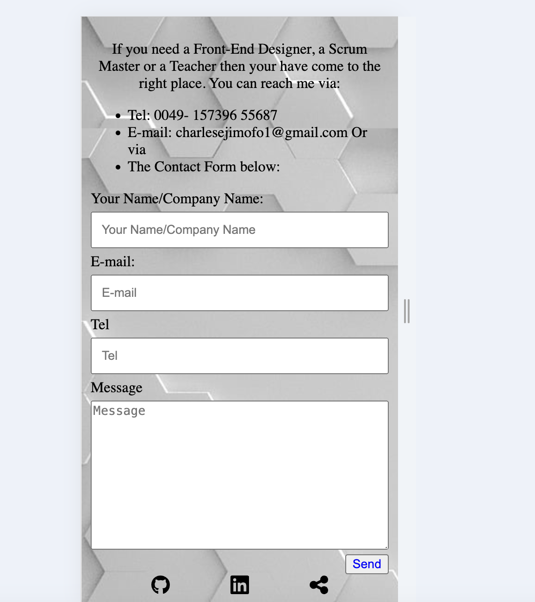

# My-Page
# My Personal WebPage
## Project Description
The objective is to create a simple static Website showing my basic 
skill of coding. Also very importantly for Employers to view my profile 
and give me a job opportunity.
The Website will be just about me: Who am I, and my skills and competency

## How it will be done
Build a Static Website about Myself with Desktop View
Create a Mobile view as default for a single sliding page Website
Using Media query add a Desktop view

## Tools and Libraries I used
<li>Github</li> 
<li>Figma</li>
<LI>Vscode</LI>
<li>Chrome</li> 
<li>Pixabay</li>
<LI>CSS Cheatsheet</LI>
<li>Terminal</li> 
<li></li>
<LI></LI>
         
## Some screenshots of My Website
